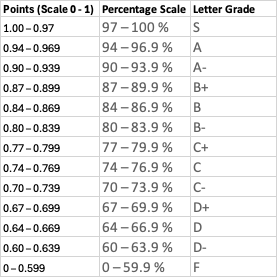
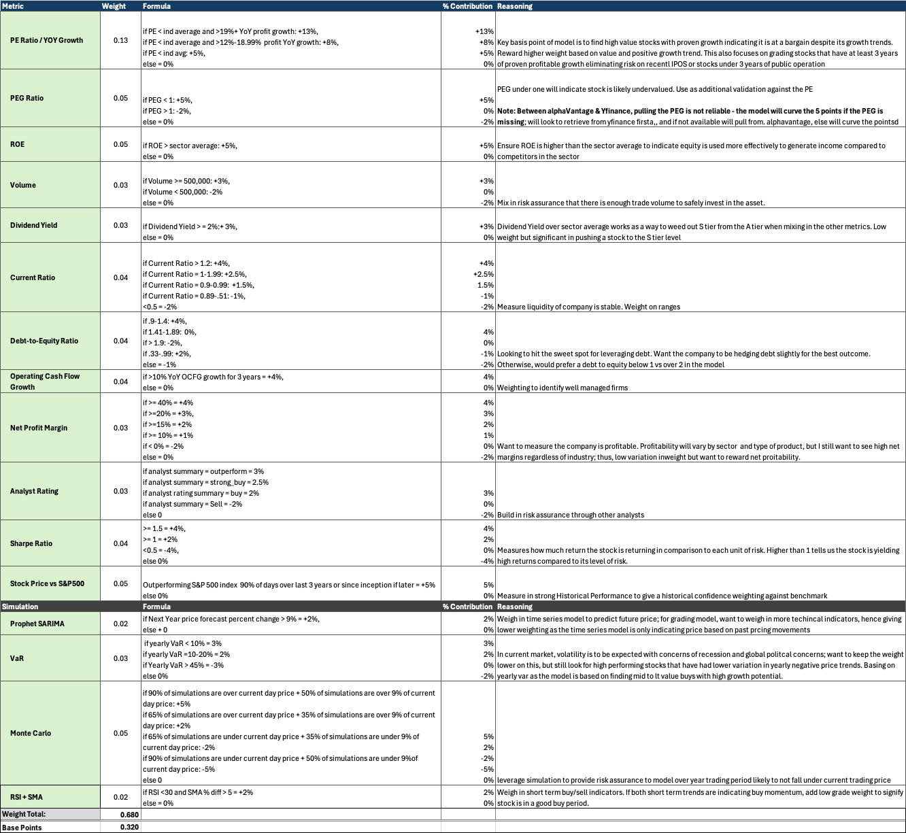

# Stock Analysis Application

A comprehensive stock analysis tool built with Streamlit that provides detailed financial analysis, forecasting, and custom grade modeling for stocks.

Production Link: https://ajstockapp.streamlit.app

## Features

- Real-time stock data analysis
- Technical indicators (RSI, MACD, Moving Averages)
- Price forecasting using Prophet
- Monte Carlo simulations
- Risk assessment (VaR calculations)
- Custom Stock grading system
- Industry comparisons
- Interactive visualizations
- AI-powered chatbot for stock analysis
- Watchlist functionality
- CI/CD
- Automated data batching/ETL
- Integration to AWS cloud storage

## Project Structure

```
stock_analysis_app/
├── app_main.py                 # Main application entry point and navigation
├── page_home.py               # Home page with detailed stock analysis and metrics
├── page_grades.py             # Stock grading and comparison page
├── page_chatbot.py            # AI chatbot interface for stock analysis
├── page_watchlist.py          # Watchlist page for chosen tickers
├── app_data.py                # Data fetching and processing utilities
├── app_constants.py           # Application constants and configurations
├── app_animations.py          # UI animations and styling
├── app_stock_grading_model.py # Stock grading algorithm implementation
├── app_grade_batch.py         # Batch processing for stock grading
├── stream_stock_price.py      # Kafka Python producer streaming stock prices every 5s (not used in prod)
├── docker-compose.yml         # Docker Compose file for Kafka + Zookeeper services (not used in prod)
├── ticker_list_ref.csv        # Reference list of available stock tickers
├── requirements.txt           # Python package dependencies
├── grade_model_assets.txt    # Contains model reference info
├── __init__.py               # Package initialization
└── .streamlit/               # Streamlit configuration directory

Note: at project root (if forking app dir would be under stock_analysis_app
├── .github                              # github resources
   └── workflows                         # github batch workflows with Github Actions
      └── stock-app-weekly-batch         # weekly batch yml for app grades used in the grades page and throughout the app
      
      (home page runs grade real time, so grades may differ across other pages)   
```

## Setup and Installation

1. Clone the repository (proj in sub dir, so cd to the sub dir):
```bash
git clone [repository-url]
cd data-science-portfolio/stock_analysis_app
```

2. Create and activate a virtual environment (recommended):
```bash
python -m venv venv
source venv/bin/activate  # On Windows: venv\Scripts\activate
```

3. Install required packages:
```bash
pip install -r requirements.txt
```

4. Run the application:
```bash
streamlit app_main.py
```

## Environment Variables

The application requires the following environment variables:
- `ALPHA_VANTAGE_API_KEY` - API key for Alpha Vantage (stock data)
- `OPENAI_API_KEY` - API key for OpenAI (chatbot functionality)

Create a `.env` or `.toml` (if using secrets.toml it must be in a folder named '.streamlit') file in the root directory with these variables:
```
ALPHA_VANTAGE_API_KEY=your_key_here
OPENAI_API_KEY=your_key_here
```

## Usage

1. Launch the application using the command above
2. Select a stock ticker from the dropdown menu
3. Navigate between different analysis pages:
   - Home: Detailed stock analysis and metrics
   - Grades: Stock grading and comparison
   - Chatbot: AI-powered stock analysis assistant

## App Navigation Pages

### Home Page (`page_home.py`)
- Real-time stock data visualization
- Technical indicators and analysis
- Price forecasting
- Risk assessment metrics
- Industry comparisons

### Grades Page (`page_grades.py`)
- Comprehensive stock grading system
- Industry comparisons
- Performance metrics
- Risk assessment

### Watchlist Page (`page_watchlist.py`)
- Watchlist page to track and monitor performance of flagged tickers

### Chatbot (`page_chatbot.py`)
- AI-powered stock analysis
- Natural language queries
- Real-time market insights

## Grade Model & Batch

### Grade Model (`app_stock_grading_model.py`)
- Holds Grading Model used throughout app
- Grades ticker based on pulled metrics and various simulations
- Custom weight / grading scales (S-F)

### Model Overview
#### Grade Scale:



#### Model Methodology:



##### Summary:

The model uses an S-F grading scale, factoring in a mix of current metrics, comparisons to historical performance, and various simulations that are valued based on weightings to ultimately score the asset. The Model is geared towards growth equity stocks with intention to hold over mid-long term (6 months or longer). The weightings evaluate more strongly to resiliancy 
and performance of the stock over mid to long-term growth as well as current operational and financial strength from a metrical standpoint. The model does not utilize specific institutional buy/sell trends but does also weight short term trends to slightly favor stocks that would be more-so at a buy indication based on its price and short term momentum. The model is 
intended to serve as suplimentary information to make buy decisions with additional data provided within or outside of the app. 

I personally use the grade model to skim down to stocks that, if having a higher grade, should overall be in good financial, operational, and risk position for the mid to LT as the model should weed out a high volume of stocks that don't 
fall within the specific model range to be considered a higher-tier buy. I will then research the higher graded stocks metrics to and outer trends and if the stock is in good financial position and has growth potential. I then evaluate from a ST perspective (can utilize home page trends/simulations like the YOY MACD) to find out if the stock may be at a discount or a buy position within the current market.

##### Disclaimer: 
This application is for informational and educational purposes only and does not constitute financial, investment, or trading advice. Always do your own research or consult a qualified financial advisor before making any investment decisions.


### Grade Batch (`app_grade_batch.py`)
- Batches grades and outputs into CSV
- Iterates through each ticker from ticker reference CSV
- Outputs score and grade by ticker into CSV
- CSV files held in S3 bucket in AWS and scheduled with EventBridge Scheduler on weekly basis

## App Constants

### Variable Constants (`app_constants.py`)
- Holds any static variables and routed key variables

### Front End Custom Variables (`app_animations.py`)
- Holds any re-callable app animations/visuals for front end
- Built with html/css (can call vars with st.markdown)
- Provides modularity to plug in error handling animations

## Data Sources

- Yahoo Finance & Alpha Vantage API for real-time stock data
- Web scraping for industry averages

## Performance Optimization

The application implements caching and session state strategies to optimize performance:
- Strategic Data Caching
- Resource caching for expensive computations
- Session state management for ticker changes & various functionality

-------
## Weekly Batches
The app uses a weekly batch using Github Actions placed at the root of the entire portfolio directory. It cannot be placed within the project sub directory due to how Github Actions reads files.
- Github actions is a tool within Github to run workflows. In the app, it is used for data batching.
- Stock grades are batched weekly within the yml file. You can change the cron job section of the yml file to a different time/date if you prefer.
- Yml example code below. Make sure this is et at the root of your directory in Github or else it will not work.
- You will then need to set up in Github Actions in you Github to run.

```
on:
schedule:
# Run Weekly on Wed at 12:00 AM EST (5:00 AM UTC)
- cron: '0 5 * * 3'
# Allow manual triggering for testing
workflow_dispatch:

   jobs:
   run-batch:
   runs-on: ubuntu-latest

    steps:
      - name: Checkout repository
        uses: actions/checkout@v4

      - name: Set up Python
        uses: actions/setup-python@v4
        with:
          python-version: '3.11'

      - name: Install dependencies
        run: |
          python -m pip install --upgrade pip
          pip install -r stock_analysis_app/requirements.txt

      - name: Run batch analysis
        env:
          ALPHA_VANTAGE_API_KEY: ${{ secrets.ALPHA_VANTAGE_API_KEY }}
          GROQ_API_KEY: ${{ secrets.GROQ_API_KEY }}
          AWS_ACCESS_KEY_ID: ${{ secrets.AWS_ACCESS_KEY_ID }}
          AWS_SECRET_ACCESS_KEY: ${{ secrets.AWS_SECRET_ACCESS_KEY }}
          AWS_REGION: ${{ secrets.AWS_REGION }}
        run: |
          cd stock_analysis_app
          python app_grade_batch.py
```


-------

## For KAFKA Streaming Stock Price Integration With Docker (Optional - Read Note)
If you'd like to add into the app the current price streaming every 5 seconds with Kafka & Docker, or test in local, follow the steps below:

IMPORTANT NOTE: The app does not use this in production as Streamlit does not support streaming a specific element. You would need to move from streamlit to implement.

### Kafka Stock Price Streaming — Local & EC2 Setup Guide

This guide walks you through how to:

- Set up Kafka locally using Docker Compose
- Run a Python Kafka producer to stream stock prices
- Optionally deploy everything on an EC2 instance

---

## 🐳 Install Docker

1. Go to [https://www.docker.com/products/docker-desktop/](https://www.docker.com/products/docker-desktop/)
2. Download Docker Desktop (choose Apple or Intel chip)
3. Install and **launch Docker Desktop**
4. Verify installation:

### macOS
```bash
docker --version
docker compose version
```

### Ubuntu (EC2 or local)
```bash
sudo apt update
sudo apt install -y docker.io docker-compose
sudo systemctl start docker
sudo systemctl enable docker
sudo usermod -aG docker $USER
```
Log out and log back in or reboot to apply the group change.

### File Structure
```bash
stock_analysis_app/
├── stream_stock_price.py       # Python Kafka producer
├── requirements.txt
└── docker-compose.yml          # Kafka + Zookeeper setup
```

### Start Kafka Locally with Docker
Ensure docker-compose.yml is in this directory, then:
```bash
docker compose up -d
```

Check containers:
```bash
docker ps
```
Stop them later with:
```bash
docker compose down
```

You can now run the script python stream_stock_price.py to test in terminal.
- To stop it: Ctrl + C

----------

## License

The MIT License (MIT)

Copyright (c) 2015 Chris Kibble

Permission is hereby granted, free of charge, to any person obtaining a copy of this software and associated documentation files (the "Software"), to deal in the Software without restriction, including without limitation the rights to use, copy, modify, merge, publish, distribute, sublicense, and/or sell copies of the Software, and to permit persons to whom the Software is furnished to do so, subject to the following conditions:

The above copyright notice and this permission notice shall be included in all copies or substantial portions of the Software.

THE SOFTWARE IS PROVIDED "AS IS", WITHOUT WARRANTY OF ANY KIND, EXPRESS OR IMPLIED, INCLUDING BUT NOT LIMITED TO THE WARRANTIES OF MERCHANTABILITY, FITNESS FOR A PARTICULAR PURPOSE AND NONINFRINGEMENT. IN NO EVENT SHALL THE AUTHORS OR COPYRIGHT HOLDERS BE LIABLE FOR ANY CLAIM, DAMAGES OR OTHER LIABILITY, WHETHER IN AN ACTION OF CONTRACT, TORT OR OTHERWISE, ARISING FROM, OUT OF OR IN CONNECTION WITH THE SOFTWARE OR THE USE OR OTHER DEALINGS IN THE SOFTWARE.
